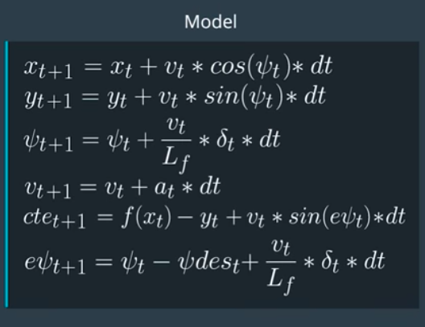

# Rubric Points

## The Model: Student describes their model in detail. This includes the state, actuators and update equations.

Model Predictive Control reframes the task of following a trajectory as an optimization problem. The solution to this optimization problem is the optimal trajectory. MPC uses an optimizer to find control inputs to the vehicle and minimize a cost function. After the first set of control inputs are executed the vehicle state is updated and the optimization process is repeated.

The vehicle state is defined as follows:  
< x (car's x coordinate), y (car' y coordinate), &psi; (car orientation), v (car velocity), cte (cross track error), e&psi; (heading error) >

The actuators are:  
< &delta; (steering angle), a (throttle value) >
 
&delta; &epsilon; [-25o, 25o]  
a &epsilon; [-1, 1]  
 

The update equation is represented by

## Student discusses the reasoning behind the chosen N (timestep length) and dt (timestep frequency) values. Additionally the student details the previous values tried.
The value of dt is kept at 0.1s; given the fact that the latency of the system is 0.1s.
The following values of N were tested. N=10 and dt=0.1 yielded best results for our system.

|=N        |=dt           |=Result  |
| ------------- |:-------------:| -----:|
|25 |0.1 | Car immediately veers off the road, very erratic turn rate |
|20 |0.1 | Worked well initially but at the final turn completely veered off the course. |
|18 |0.1 | Car immediately veers off the road |
|15 |0.1 | Car stays on the road but stops completely at the last turn |
|10 |0.1 | Car stays on the road stops completely at sharp turn. Updated the cost of the steering and velocity to get the car to complete the turn |

One observation is that small differences in N result in very different behavior from this system. Also for N=20,15 the results were similar to N=10 but completely stopped at some of the turns. I did not retry tuning for N=20,15 but intuitively feel that tuning the cost would also aid in completing these turns.

Towards the end of the round, even for N=10, t=0.1s however the car seems to move side to side very often.

PFA video of the car completing a successful round -

## A polynomial is fitted to waypoints. If the student preprocesses waypoints, the vehicle state, and/or actuators prior to the MPC procedure it is described.

Prior to the MPC procedure the following changes were made

* To account for latency of 0.1s the values of x (global car position x), y (global car position y), v (velocity), &psi (orientation); were recalculated.

* The global x and y coordinates were then transformed to the car's coordinate system. This was to ease calculations for the MPC solver

* The points were then fit to a 3rd degree polynomial equation to determine our projected trajectory and the cross-track error was calculated. These values were used by MPC.cpp to perform optimization.

## Model Predictive Control with Latency: The student implements Model Predictive Control that handles a 100 millisecond latency. Student provides details on how they deal with latency.

* To account for latency of 0.1s the values of x (global car position x), y (global car position y), v (velocity), &psi (orientation); were recalculated as follows -
   
velocity += throttle x latency;
   
&psi; += velocity / Lf x -steer x latency;
   
global\_x\_coordinate += velocity.cos(&psi;) x latency;
   
global\_y\_coordinate += velocity.sin(&psi;) x latency;
 

* An additional cost penalizing the combined effect of velocity and turning rate was needed to determine the sharper turns.
